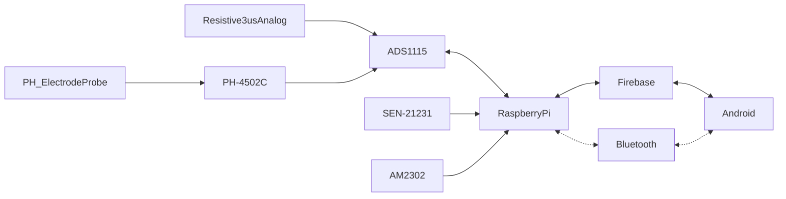

# Brief CENG Capstone Project Charter
-  [x] Select Project area:
1. [ ] :bike: Facilities: e.g. Bicycle Rental/Parking Lot/Vision System
2. [x] :factory: Building Automation: e.g. Greenhouse/SolarPanel/Home
3. [ ] :movie_camera: Consumer: e.g. Entertainment Protocol DMX/Baby Monitoring Project
4. [ ] :mortar_board: Education: e.g. Robust Hackable Educational Project
5. [ ] :robot: Robotics: e.g. Control/Navigation/Dashboard
6. [ ] :ski: Health and Wellness: e.g. Wearable
####  Project Title: 
Pet Animal Feeder

####  Executive Summary/Description of the Project (75 to 100 words): 
This project presents a cutting-edge pet healthcare monitoring system designed to improve the welfare of pets. The system enables tracking of vital health metrics including changes in weight, PH levels in drinking water, and ambient room temperature. It also allows the user to monitor when the pet is eating or drinking. It caters to the increasing need for pet care solutions in household monitoring, providing a holistic approach to managing pet health.

####  Has this project been approved by all parties for posting (Y/N)?
-  [x] Yes
-  [ ] No

Optional Collaborator fields for sponsored projects

#### Sponsoring Industry and Personnel: 
#### Hours contributed: 
#### Number of full-time employees, year established, private or not-for-profit: 
#### Value of equipment or access to equipment provided: 
#### FAST contribution: 

####  List of Names of Students Involved in Project (first and last names and separate members by a comma):
Jasnam Gill, Aaron Jara, Robert Rowlison, Damanpreet Singh

####  Planned contact email for the [Expo submission form](https://appliedtechnology.humber.ca/shows/past-shows/advanced-manufacturing-projects/advanced-manufacturing-student-submission-form.html)
aaronjara367@gmail.com

####  For each individual student state whether they have a complete parts kit, a multimeter, what development platform they have, what sensors/effectors they have along with system Requirements (List what sensors/effectors are to do), functionalty of prototype/describe any unsoldered connections.
Jasnam Singh Gill:
- [x] Complete parts kit
- [ ] Multimeter
- Development platform: Broadcom single board computer
- Sensor/effector 1:
  - Device name: DHT22 / AM2302 Digital Temperature and Humidity Sensor
  - Link to online product page: https://www.amazon.ca/gp/product/B07L3GJH7J/ref=ppx_yo_dt_b_search_asin_title?ie=UTF8&psc=1
  - I2C address: Device does not have i2c address as sensor connects directly to power, ground, and gpio4 pins on the raspberry pi
  - WHO-AM-I: Single Wire protocol
  - DEV_ID: Single Wire protocol
  - Additional device specific components: Not applicable
  - Additional device specific connections in addition to or instead of Qwiic cable: Not applicable
  - Current hardware operational status: Functional

Aaron Morris Basco Jara:
- [x] Complete parts kit
- [x] Multimeter
- Development platform: Broadcom single board computer
- Sensor/effector 2:
  - Device name: Person Sensor by Useful Sensors
  - Link to online product page: https://www.sparkfun.com/products/21231
  - I2C address: 0x62
  - WHO-AM-I: fnctl.h not found
  - DEV_ID: fnctl.h not found
  - Additional device specific components: N/A
  - Additional device specific connections in addition to or instead of Qwiic cable: N/A
  - Current hardware operational status: Functional

Robert Rowlison:
- [x] Complete parts kit
- [x] Multimeter
- Development platform: Broadcom single board computer
- Sensor/effector 3: 
  - Device name: Phoncoo Liquid PH Value Detection detect Sensor Module Monitoring Control Board for Arduino BNC Electrode Probe Controller
  - Link to online product page: https://www.amazon.ca/Detection-Monitoring-Control-Electrode-Controller/dp/B07KDPQGYD/ref=asc_df_B07KDPQGYD/?tag=googleshopc0c-20&linkCode=df0&hvadid=335359065098&hvpos=&hvnetw=g&hvrand=13456145975713696951&hvpone=&hvptwo=&hvqmt=&hvdev=c&hvdvcmdl=&hvlocint=&hvlocphy=9000993&hvtargid=pla-697536157332&psc=1
  - I2C address: Selectable between 0x48-0x4B
  - WHO-AM-I:
  - DEV_ID: 0x5F
  - Additional device specific components: ADS1015 12-Bit ADC - 4 Channel with Programmable Gain Amplifier - STEMMA QT / Qwiic
  - Additional device specific connections in addition to or instead of Qwiic cable: Breadboard connecting the ADS and the PH Sensor.
  - Current hardware operational status: Operational

Damanpreet Singh :
- [x] Complete parts kit
- [ ] Multimeter
- Development platform: Broadcom single board computer
- Sensor/effector 4:
  - Device name: ADS1115 16-Bit ADC - 4 Channel and SENSOR RESISTIVE 3US ANALOG
  - Link to online product page:[ADS1115 16-Bit ADC - 4 Channel](https://www.adafruit.com/product/1085) and [SENSOR RESISTIVE 3US ANALOG]( https://www.digikey.ca/en/products/detail/interlink-electronics/30-73258/2476470)
  - I2C address: 0x48
  - WHO-AM-I:
  - DEV_ID: 0xffffff87
  - Additional device specific components: 
  - Additional device specific connections in addition to or instead of Qwiic cable: Breadboard connecting the ADS and the RESISTIVE Sensor.
  - Current hardware operational status: Operational

####  GitHub repository link(s):
[Hardware link](https://github.com/PrototypeZone/hardware-project-DamanpreetSingh6028.git)
[Application link](https://github.com/MediMuamba/SmartFeeder.git)

####  Google Play App download link:
[Smart Feeder](https://play.google.com/store/apps/details?id=ca.techinnovators.smartfeeder)

#### Hours per student:
$14\*3=42$ in class hours, $14\*3=42+$ outside of class.

#### Supervising Faculty: 
Kris Medri   

####  Hours per faculty: 
$14\frac{3}{20}\*3=6.3$ in class, $14\frac{1.05+1.49}{20}\*3=5.334+$ outside of class.

####  Scope:
Creation of a Prototype that is not to be left powered unattended. Keeping safety and Z462 in mind, the highest AC voltage that is to be used is 16Vrms from a wall adapter from which +/- 15V or as high as 45 VDC can be obtained. Maximum power consumption is to be 20 Watts. In alignment with the space below the tray in the Humber North Campus Electronics Parts kit the overall project maximum dimensions are 12 13/16" x 5 ¹/₂" x 2 ³/₄" = 32.5cm x 14cm x 7cm. If your PCB doesn’t work or you need to switch sensors/effectors, it is recommended that you use the SparkFun Qwiic system: https://www.sparkfun.com/products/15945

####  Design approach:

####  Mandate: 
Self funded (unless a sponsor has contractually agreed to contribute).
